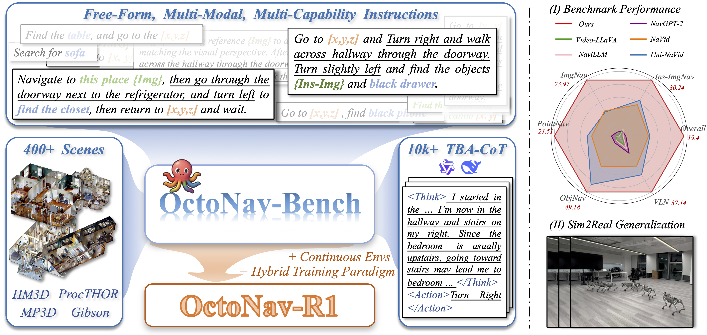
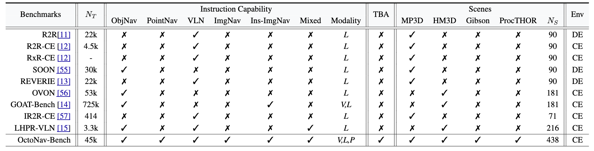

<h3>OctoNav: Towards Generalist Embodied Navigation</h3>

[Chen Gao](https://chengaopro.github.io/)1,2*&nbsp;
Liankai Jin1*&nbsp;
Xingyu Peng1,4*&nbsp;
[Jiazhao Zhang](https://jzhzhang.github.io/)3&nbsp;
 
Yue Deng1,4&nbsp;
Annan Li1&nbsp;
[He Wang](https://scholar.google.com/citations?hl=zh-CN&user=roCAWkoAAAAJ)3&nbsp;
[Si Liu](https://scholar.google.com/citations?user=-QtVtNEAAAAJ&hl=zh-CN)1+&nbsp;

1Beihang University&nbsp; 2 National University of Singapore&nbsp; 3Peking University&nbsp; 4Zhongguancun Academy&nbsp;
 
  

  >

On the left, we present the large-scale OctoNav-Bench, which contains diverse instruction-trajectory pairs and the elaborate TBA-CoT dataset across numerous scenes. Based on OctoNav-Bench and our method/training designs, we introduce a VLA-based method, termed OctoNav-R1. On the right, (I) demonstrates the performance comparisons on OctoNav-Bench, where we provide a fine-grained breakdown of accuracy across various navigation capabilities. OctoNav-R1 outperforms previous methods in all capabilities, demonstrating its versatility. (II) presents a robot demo in the real world, which is driven by the OctoNav-R1, showing its preliminary sim2real generalization.

## What is the OctoNav-Bench?
A large-scale and unified benchmark specifically designed for generalist embodied navigation, which is distinguished by the following core features. 
* **Large-scale Annotations:** OctoNav-Bench encompasses 400+ diverse 3D scenes sourced from widely used HM3D and Gibson etc. Also, OctoNav-Bench provides 45k+ annotated instruction-trajectory pairs via the designed automatic annotation pipeline, supporting large-scale training. 
* **Freeform, Multi-Model and Multi-capability Instructions:** The instructions are generated in free-form descriptions. First, the capabilities included in the instruction are sampled from arbitrary combinations of ObjNav, PointNav, ImgNav, Ins-ImgNav, and VLN, i.e., each instruction contains multiple navigation capabilities simultaneously. Moreover, these instructions are multimodal, incorporating textual, visual (e.g., reference scene-/object-level images), and spatial (e.g., coordinates) descriptions.
* **TBA-CoT Dataset:** We leverage Qwen-VL and DeepSeek-R1 to construct a Think-Before-Action Chain-of-Thought (TBA-CoT) dataset, which captures the deliberative reasoning process behind each action decision. Such a dataset can be used to supervise and enhance the agent’s reasoning ability.
* **Continuous Environments with RL Support:** Unlike discrete or graph-based settings, OctoNav-Bench provides continuous simulation environments, allowing agents to move freely and acquire visual observations at arbitrary locations. Thus, it supports active learning like online RL.
 
 

  >

  <em style="font-size: 12px;">
*Comparisons between OctoNav-Bench and previous benchmarks.* NT denotes the task number. Mixed indicates whether a single instruction integrates multiple capabilities. Modality is the modality within instructions, where [V,L,P] denote [vision, language, point]. TBA presents the think-before-action annotations. DE, CE denote the discrete and continuous environments.
  </em>

## What is the OctoNav-R1?
A VLA-based model designed and trained on OctoNav-Bench, and is distinguished by the following key aspects: 
* **Free-form, Multimodal and Multi-capability Instruction Following:** OctoNav-R1 can accept free-form instructions that comprise multi-modal and multi-capability. Based on step-wise egocentric visual observations, the model can directly generate a sequence of low-level actions (e.g., move forward, turn left/right), enabling it to follow complex instructions in a unified manner. 
* **RL-enhanced VLA Hybrid Training Paradigm:** Unlike conventional VLA models that are typically fine-tuned via SFT on static datasets, OctoNav-R1 are trained by the proposed Hybrid Training Paradigm (HTP). Specifically, we integrate RL into the VLA training pipeline, making HTP combine Action-/TBA-SFT, Nav-GRPO, and online RL stages. 
* **Thinking-Before-Action:** Inspired by the long CoT reasoning within DeepSeek-R1, we argue that previous VLA models, which directly map observations to actions, lack explicit thinking processes and struggle with complicated tasks. Therefore, we leverage the TBACoT dataset to train OctoNav-R1 via TBA-SFT and Nav-GRPO, endowing the model with the ability to jointly produce thinking thoughts and action sequences. 
* **Initial Sim2Real Generalization:** We deploy OctoNav-R1 on physical robots, and observe preliminary sim-to-real transfer ability without real-world fine-tuning. It further confirms the annotated OctoNav-Bench and designed OctoNav-R1.
