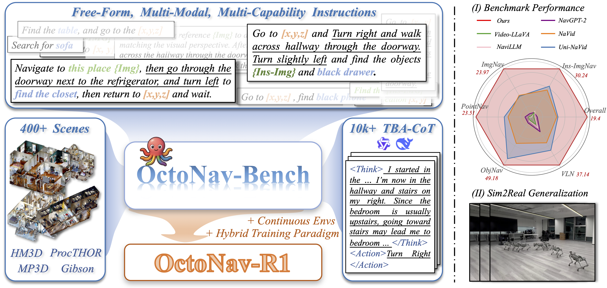
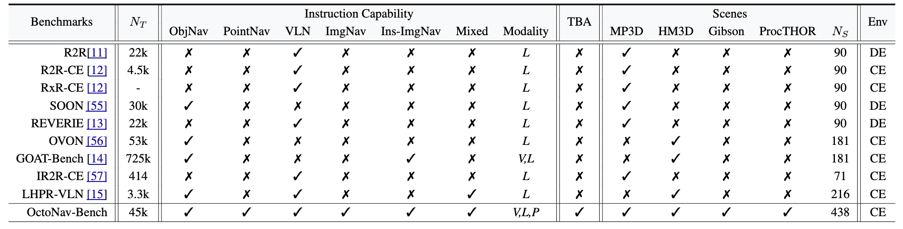

<div align="center">
<h1>OctoNav: Towards Generalist Embodied Navigation</h1>

[Chen Gao](https://chengaopro.github.io/)<sup>1,2*</sup>&nbsp;
Liankai Jin<sup>1*</sup>&nbsp;
Xingyu Peng<sup>1,4*</sup>&nbsp;
[Jiazhao Zhang](https://jzhzhang.github.io/)<sup>3</sup>&nbsp;
<br>
Yue Deng<sup>1,4</sup>&nbsp;
Annan Li<sup>1</sup>&nbsp;
[He Wang](https://scholar.google.com/citations?hl=zh-CN&user=roCAWkoAAAAJ)<sup>3</sup>&nbsp;
[Si Liu](https://scholar.google.com/citations?user=-QtVtNEAAAAJ&hl=zh-CN)<sup>1+</sup>&nbsp;

<sup>1</sup>Beihang University&nbsp; <sup>2</sup> National University of Singapore&nbsp; <sup>3</sup>Peking University&nbsp; <sup>4</sup>Zhongguancun Academy&nbsp;

<div>
    <strong>CVPR 2026</strong>
</div>

<div>
    <h4 align="center">
        <a href="https://arxiv.org/pdf/2506.09839" target='_blank'>
        
        </a>
        <a href="https://buaa-colalab.github.io/OctoNav/" target='_blank'>
        
        </a>
        <a href="https://buaa-colalab.github.io/OctoNav/" target='_blank'>
        
        </a>
    </h4>
</div>


<p align="center">
  
</p>

</div>
On the left, we present the large-scale OctoNav-Bench, which contains diverse instruction-trajectory pairs and the elaborate TBA-CoT dataset across numerous scenes. Based on OctoNav-Bench and our method/training designs, we introduce a VLA-based method, termed OctoNav-R1. On the right, (I) demonstrates the performance comparisons on OctoNav-Bench, where we provide a fine-grained breakdown of accuracy across various navigation capabilities. OctoNav-R1 outperforms previous methods in all capabilities, demonstrating its versatility. (II) presents a robot demo in the real world, which is driven by the OctoNav-R1, showing its preliminary sim2real generalization.
    
## 💡 Highlights

### What is the OctoNav-Bench?
A large-scale and unified benchmark specifically designed for generalist embodied navigation, which is distinguished by the following core features. 
* **Large-scale Annotations:** OctoNav-Bench encompasses 400+ diverse 3D scenes sourced from widely used HM3D and Gibson etc. Also, OctoNav-Bench provides 45k+ annotated instruction-trajectory pairs via the designed automatic annotation pipeline, supporting large-scale training. 
* **Freeform, Multi-Model and Multi-capability Instructions:** The instructions are generated in free-form descriptions. First, the capabilities included in the instruction are sampled from arbitrary combinations of ObjNav, PointNav, ImgNav, Ins-ImgNav, and VLN, i.e., each instruction contains multiple navigation capabilities simultaneously. Moreover, these instructions are multimodal, incorporating textual, visual (e.g., reference scene-/object-level images), and spatial (e.g., coordinates) descriptions.
* **TBA-CoT Dataset:** We leverage Qwen-VL and DeepSeek-R1 to construct a Think-Before-Action Chain-of-Thought (TBA-CoT) dataset, which captures the deliberative reasoning process behind each action decision. Such a dataset can be used to supervise and enhance the agent’s reasoning ability.
* **Continuous Environments with RL Support:** Unlike discrete or graph-based settings, OctoNav-Bench provides continuous simulation environments, allowing agents to move freely and acquire visual observations at arbitrary locations. Thus, it supports active learning like online RL.
<br>
<br>

<p align="center">
  >
</p>
<p>
  <em style="font-size: 12px;">
*Comparisons between OctoNav-Bench and previous benchmarks.* NT denotes the task number. Mixed indicates whether a single instruction integrates multiple capabilities. Modality is the modality within instructions, where [V,L,P] denote [vision, language, point]. TBA presents the think-before-action annotations. DE, CE denote the discrete and continuous environments.
  </em>
</p>

### What is the OctoNav-R1?
A VLA-based model designed and trained on OctoNav-Bench, and is distinguished by the following key aspects: 
* **Free-form, Multimodal and Multi-capability Instruction Following:** OctoNav-R1 can accept free-form instructions that comprise multi-modal and multi-capability. Based on step-wise egocentric visual observations, the model can directly generate a sequence of low-level actions (e.g., move forward, turn left/right), enabling it to follow complex instructions in a unified manner. 
* **RL-enhanced VLA Hybrid Training Paradigm:** Unlike conventional VLA models that are typically fine-tuned via SFT on static datasets, OctoNav-R1 are trained by the proposed Hybrid Training Paradigm (HTP). Specifically, we integrate RL into the VLA training pipeline, making HTP combine Action-/TBA-SFT, Nav-GRPO, and online RL stages. 
* **Thinking-Before-Action:** Inspired by the long CoT reasoning within DeepSeek-R1, we argue that previous VLA models, which directly map observations to actions, lack explicit thinking processes and struggle with complicated tasks. Therefore, we leverage the TBACoT dataset to train OctoNav-R1 via TBA-SFT and Nav-GRPO, endowing the model with the ability to jointly produce thinking thoughts and action sequences. 
* **Initial Sim2Real Generalization:** We deploy OctoNav-R1 on physical robots, and observe preliminary sim-to-real transfer ability without real-world fine-tuning. It further confirms the annotated OctoNav-Bench and designed OctoNav-R1.

## 🛠️ Usage

### Installation

OctoNav-Bench is based on Habitat Simulator as the backend: [habitat-lab](https://github.com/facebookresearch/habitat-lab) and [habitat-sim](https://github.com/facebookresearch/habitat-sim).

1. **Preparing conda env**

   Assuming you have [conda](https://docs.conda.io/projects/conda/en/latest/user-guide/install/) installed, please prepare a conda env:

   ```shell
   conda create -n octonav python=3.9 cmake=3.14.0
   conda activate octonav
   ```

2. **Installing habitat-sim**

    ```shell
    conda install habitat-sim==0.3.2 withbullet -c conda-forge -c aihabitat
    ```
    Tips: If you encounter errors like
    ```
    Platform::WindowlessEglApplication::tryCreateContext(): unable to find CUDA device 0 among xx EGL devices in total 
    WindowlessContext: Unable to create windowless context
    ```
    Try to [download](https://anaconda.org/aihabitat/habitat-sim/files?page=1) habitat-sim package and install it locally.

3. **Installing OctoNav-Bench**.

   ```shell
   git clone 
   cd OctoNav-Bench
   pip install -e octonav-bench
   ```

### Data Preparation

#### Scene Dataset

OctoNav-Bench supports four scene datasets: HM3D(v0.2), MP3D, Gibson and ProcTHOR(from AI2-THOR).

To download these scene datasets, you can follow the [datasets download instructions](https://github.com/facebookresearch/habitat-sim/blob/main/DATASETS.md) from habitat-sim, and remember to put them in the correct path, like：

``` 
data/scene_datasets
├── ai2thor-hab
│   ├── ai2thor-hab
│   ├── ai2thorhab-uncompressed
│   └── README.md
├── gibson
│   ├── ...
│   ├── Yscloskey.glb
│   └── Yscloskey.navmesh
├── hm3d_v0.2
│   ├── train
│   └── val
└── mp3d
    ├── ...
    └── zsNo4HB9uLZ
```

Note that Gibson Dataset (trainval) for use with Habitat (11 GB) is required in OctoNav-Bench, please make sure you download the right version.

#### Task Dataset

We only provide the training dataset currently.

Download Link: [Onedrive](https://onedrive.live.com/?id=AA19F644CF9D8AFB%21s0e242c4332eb4ec29b4cc3dd2b0789df&cid=AA19F644CF9D8AFB&sb=name&sd=1&view=0) or [Baidu Cloud](https://pan.baidu.com/s/16pboBS1nIYHrFVDY0nC1og?pwd=mcbf) or [HuggingFace](https://huggingface.co/datasets/Oshwiciqwq/OctoNav-Bench).

Download `octonav_train.tar` and unzip, then put the `octonav` folder into `data/datasets`.

#### SFT Dataset(For Training)

It is recommanded to download the images and videos.

Download Link: [Onedrive](https://onedrive.live.com/?id=AA19F644CF9D8AFB%21s0e242c4332eb4ec29b4cc3dd2b0789df&cid=AA19F644CF9D8AFB&sb=name&sd=1&view=0) or [Baidu Cloud](https://pan.baidu.com/s/16pboBS1nIYHrFVDY0nC1og?pwd=mcbf) or [HuggingFace](https://huggingface.co/datasets/Oshwiciqwq/OctoNav-Bench).

Download `sft_data` folder, unzip the images and videos inside.

```shell
cat image.tar.gz.* | tar -xzvf -
cat video.tar.gz.* | tar -xzvf -
```

We also provide a generator script to run the simulator and produce the images and videos locally. You can only download `sft_data/sft_action.json` and `sft_data/sft_cot.json`.

```shell
cd octonav-bench/generate
python generate_sft_data.py
```

### How to do Evaluation

Use `habitat.Env` to interact with the environment. It's convenient to use OctoNav-Bench with your own agent.

#### Evaluation Process

Firstly, get the environment config and instantiate the environment using `habitat.Env(config=config)`. Then, for each episode, run `env.reset()` to reset the environment and switch to the next episode. After that, your agent can perform actions based on observations. The actions that agent can perform are `move_forward`, `turn_left`, `turn_right`, `look_up`, `look_down`. Use `env.reset(action)` to perform an action. Finally, make a `stop` action and get the metrics when finished the task.

The observation obtained from `env.step()` and `env.reset()` includes image and task instruction，the format is shown as below：

```python
observation = {
  'rgb': numpy.ndarray, # rgb image observed by agent
  'instruction': {
    'text': str, # instruction text
    'ImageNav': numpy.ndarray, # rgb image of ImageNav target(Optional)
    'InstanceImageNav': numpy.ndarray # rgb image of InstanceImageNav target(Optional)
  }
}
```

Also, a `top_down_map` is provided in the environment metrics, you can save it in each step and make a trajectory video. But note that current `top_down_map` only support the floor where episodes start, and the map would be a mess if agent goes upstairs or downstairs.

#### Examples 

For detailed implementation, see these examples. 

An example of random agent: `example_random_agent.py` 

- You can change the random agent to your agent.

An example of NaVid agent:

```python
# From NaVid Evaluation
def evaluate_agent(agent, result_path) -> None:
    config = habitat.config.get_config_and_task(
        config_path="benchmark/nav/octonav/octonav_bench_val.yaml",
    )
    env = habitat.Env(config=config)
    num_episodes = len(env.episodes)
    
    EARLY_STOP_ROTATION = 25
    EARLY_STOP_STEPS = 500

    agg_metrics: Dict[str, Dict] = defaultdict(Dict)
    task_cnt: Dict = defaultdict(int)
    final_results = []
    for _ in trange(num_episodes):
        obs = env.reset()
        info = env.get_metrics()
        iter_step = 0
        agent.reset(episode_id=_-1)
         
        continuse_rotation_count = 0
        last_dtg = 999
        while not env.episode_over:
            
            info = env.get_metrics()
            
            if info['OctoNav']["distance_to_goal"] != last_dtg:
                last_dtg = info['OctoNav']["distance_to_goal"]
                continuse_rotation_count=0
            else :
                continuse_rotation_count +=1 
            
            
            action = agent.act(obs, info['OctoNav'], env.current_episode.episode_id)
            
            if continuse_rotation_count > EARLY_STOP_ROTATION or iter_step>EARLY_STOP_STEPS:
                action = {"action": 0}

            
            iter_step+=1
            obs = env.step(action)
        result_dict = env.get_metrics()
        for task, v in result_dict.items():
            if task not in agg_metrics.keys():
                agg_metrics.setdefault(task, defaultdict(float))
            for metric, value in v.items():
                if metric == "top_down_map":
                    continue
                agg_metrics[task][metric] += value
            task_cnt[task] += 1

        final_results.append({
            'id': _,
            'tasks': [episode.task_name for episode in env._current_episode.task_episodes],
            'metrics': env.get_metrics()
        })
        with open(os.path.join(os.path.join(result_path, "log"),"{}.json".format(_)), "w") as f:
            if 'top_down_map' in result_dict['OctoNav'] :
                del result_dict['OctoNav']['top_down_map']
            json.dump(result_dict, f, indent=4)
        agent.reset(episode_id=_)

    for task_name in agg_metrics.keys():
        for m in agg_metrics[task_name].keys():
            agg_metrics[task_name][m] /= task_cnt[task_name]
    print(agg_metrics)
    with open(os.path.join(result_path, 'final_results.json'), 'w') as f:
        json.dump(final_results, f)
    with open(os.path.join(result_path, 'metrics.json'), 'w') as f:
        json.dump(agg_metrics, f)
```

## 📝 Citation

If you find this work useful, please consider citing our paper:

```bibtex
@article{gao2025octonav,
  title={Octonav: Towards generalist embodied navigation},
  author={Gao, Chen and Jin, Liankai and Peng, Xingyu and Zhang, Jiazhao and Deng, Yue and Li, Annan and Wang, He and Liu, Si},
  journal={arXiv preprint arXiv:2506.09839},
  year={2025}
}
```

## 📄 License

This project is licensed under the MIT License. See [LICENSE](./LICENSE) for more information.

## 🙏 Acknowledgement

We sincerely thank [Habitat-Lab](https://github.com/facebookresearch/habitat-lab) and [Habitat-Sim](https://github.com/facebookresearch/habitat-sim) for their outstanding contributions to embodied AI simulation, convenient action APIs and open-source release.